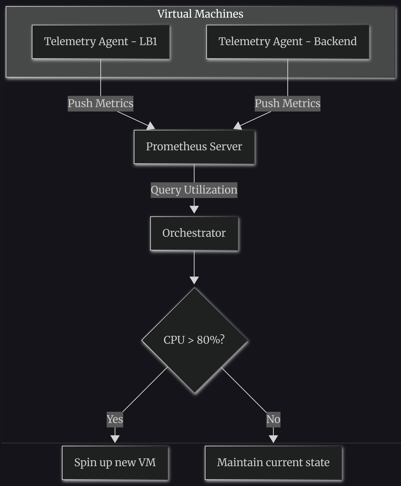

# Designing a Distributed Load Balancer: CoreDNS, Prometheus, and the Art of Failure

## The Philosophy of Distributed Systems

At its core, a Distributed System (DS) takes **multiple independent components and machines** and weaves them into a **single, coherent system** to solve a much bigger problem. 

For an end-user, Facebook is just a single website. But behind the curtain, it's a massive mesh of thousands of services handling caching, databases, recommendations, and real-time messaging. 

**DS gives you the ability to abstract away that underlying distributed mess.** To you, the developer, it looks like one system—but in reality, it's an army of machines doing their specific jobs.

> **⚠️ Murphy's Law for Distributed Systems:** 
> *"The best and worst thing about DS is: Anything that could go wrong, will go wrong."*

---

## 🗝️ The Key to Designing a Good Distributed System

> **Assume anything and everything will go wrong—literally.** 
> Then, ask yourself: *"Is my code handling this failure gracefully?"*

Start with a **Day 0 architecture**. Don't over-engineer for 1 billion users on day one. Scale iteratively:

1. Build a simple, working version.
2. See how it performs under load.
3. Rectify the bottlenecks.
4. Re-architect and repeat.

Scale each component **independently**.

---

## Why Do We Even Need Distributed Systems?

- **Scale**: Handle more users and more data than a single machine ever could.
- **Horizontal Scalability**: Just add more machines (scale out) instead of buying a bigger one (scale up).
- **Fault Tolerance**: If one machine dies, the system stays online.

---

## 🚦 Deep Dive: The Load Balancer (LB)

The **Load Balancer** is the most important component in any system. 

### 1. Design Requirements for an LB
- Balancing the load
- Tunable algorithms (Round Robin, Least Connections, Hashing)
- Scaling beyond one machine (LB itself must be fault-tolerant)
- Configuration storage, monitoring, availability, and extensibility

### 2. How the LB Knows a Server is Down

**Approach 1: Push-based (Reactive) - RECOMMENDED** 
Handled by your Orchestrator or Database using CDC (Change Data Capture). When a backend server goes down, a signal is instantly pushed to the LB. This gives us **immediate reactivity** and minimizes downtime.

**Approach 2: Pull-based (Polling)**
The LB periodically asks the backend, *"Are you alive?"* While simpler, it introduces latency.

---

## 📊 Monitoring the Universe (Prometheus & Telemetry)

It's not enough to just health-check the LB. You need to monitor CPU, Disk, and Memory of **every VM** (both LBs and Backends).

- A **Telemetry Agent** runs on every VM.
- These agents push metrics to a central **Prometheus** server.
- Your **Orchestrator** checks average utilization from Prometheus and decides to scale up or down.

---

## 🌐 The DNS Dilemma & CoreDNS

We have 2 or more Load Balancer servers. How does the client know which IP to hit?

**Solution: Private DNS.**
We assign a **private domain name** to the LB cluster, like `payment.lb.google.com`.

**Enter CoreDNS:**
- You run a private instance of CoreDNS inside your infrastructure.
- Every VM points to this CoreDNS as its resolver.
- CoreDNS holds the IPs of **all** LBs and returns one via Round Robin.

> **Note:** DNS does **not** proxy traffic. It simply resolves the domain to an IP and hands it back. The connection is directly between the User and the LB.

---

## 🔄 The Complete Request Flow

